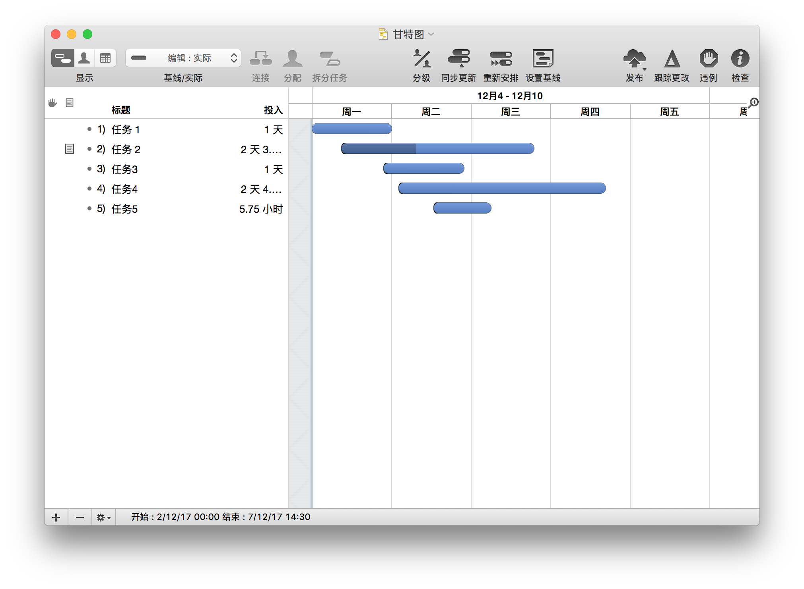
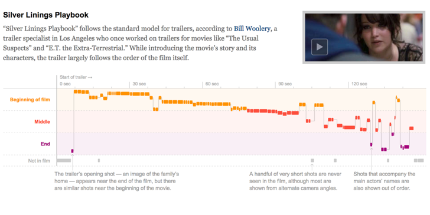
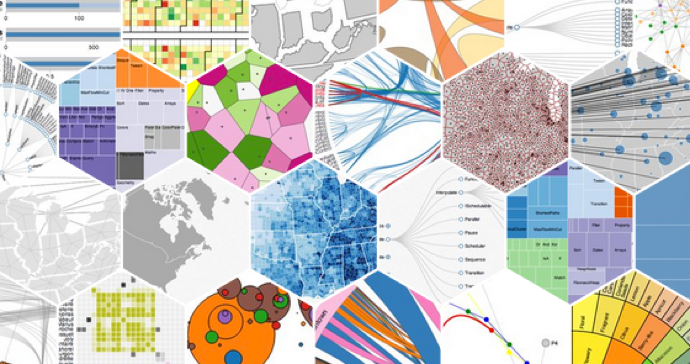
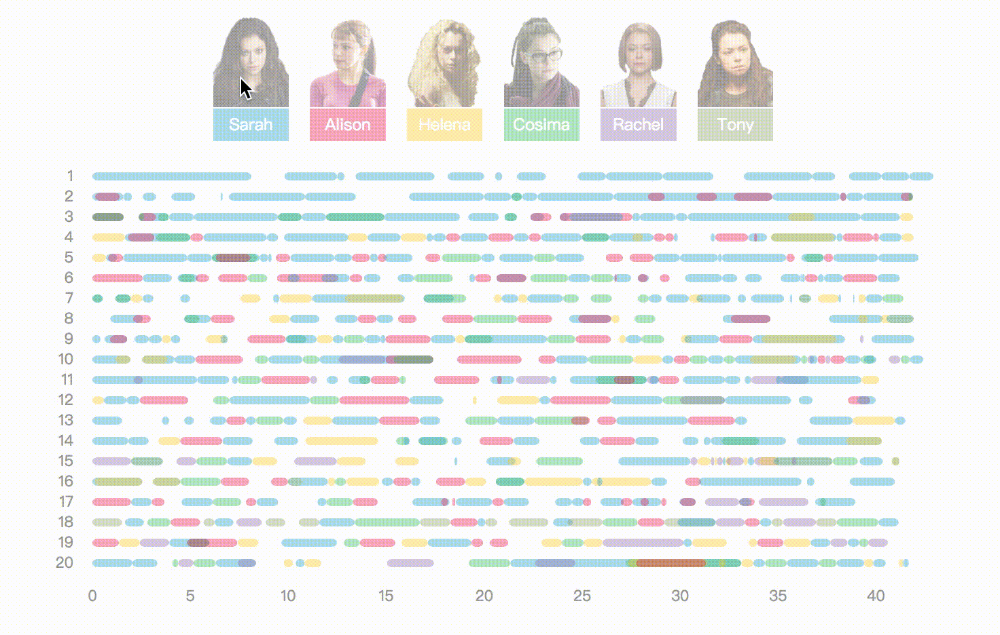
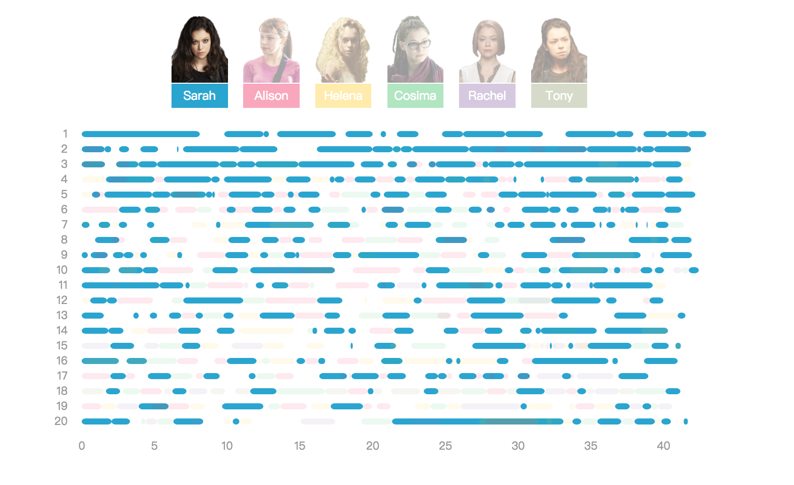

# 可视化——用D3.js实现甘特图
#### 甘特图
甘特图（Gantt Chart）在1910年由亨利甘特开发出来。甘特图本质上是条形图，特点在于它是基于时间序列的，是对特定事件、类型、任务等持续时间长短的可视化表现，通常被用于制作项目规划管理、个人计划等。如Omniplan是一款专门用于项目管理的工具，它便是基于甘特图进行可视化的。



以下是甘特图的一些例子（图片均来自[datavizproject.com](http://datavizproject.com/data-type/gannt-chart/)），同其他可视化图表一样，它可以通过不同的颜色、形状、大小来丰富自身的表现力。


甘特图一般表现为以时间序列为横坐标，纵向则是所要表现的基于时间变化的对象。通过图片可以发现它与一般影视制作软件的时间轴版块特别相像，如Flash、After Effect等软件，可以在时间轴版块的纵向上添加图层、音乐等。因此其实甘特图除了特别适合做项目管理之外，它也适合应用在音乐、影视等基于时间线发展的内容分析上。如下图，在2013年奥斯卡奖颁奖之前，纽约时报对5部获得[最佳影片提名电影的预告片](http://www.nytimes.com/interactive/2013/02/19/movies/awardsseason/oscar-trailers.html)进行分析，通过将预告片中出现的镜头与其在正片中的位置、时长进行对比，分析各个电影是如何剪辑预告片，对作品进行宣传。




接下来将介绍如何使用D3这个JS插件做一个基于《黑色孤儿》中演员在剧中出现场景时长的甘特图。
#### 用D3实现甘特图


> D3.js是一个用动态图形显示数据的JavaScript库，一个数据可视化的工具。兼容W3C标准，并且利用广泛实现的SVG，JavaScript，和CSS标准。    

*开始实例之前，需要对基本的网页制作有所了解，html（标签元素，div/img/p...；属性，class/id/style...），css（样式设置，margin/font/background...），javascript（函数；DOM事件...）或者jQuery（javascript库，简化javascript编程），以及SVG（元素，rect/line/path...；属性：x/y/fill...）*



效果图如图，将美剧《黑色孤儿》中演员Tatiana Maslany（一人饰多角）在剧中第一、二季出演的情况可视化表现出来，可以直观地看出单个演员在剧中所占的份量。布局很简单，上面为演员饰演的几个角色的图片标签，下面就是由D3数据驱动所绘制出的甘特图，纵坐标为第一、二季的集数，横坐标就是每一集中的时间序列。图片标签及其交互主要是由css和javascript简单实现的，不做过多介绍，下面重点介绍中间使用D3库所绘制的甘特图部分的代码。

D3.js的主要特点是数据驱动，即利用数据驱动去操作DOM，我们只需要关心数据的表现形式，如何绘制出合适的图表。因此D3在使用上其实跟PS等绘图软件特别类似，确定位置、样式，然后绘制出想要的形状，不同的只是D3是通过链式代码来绘制SVG从而实现效果。

在html文件中，主要使用的div和script如下，`#imgLable`为上面提到的图片标签；`#mainGantt`便是主要的绘图区域；jquery.js可以简化javascript编程，语法更加简单；d3.v3.min.js就是D3库了，加载之后我们才能使用d3的各种方法；data.js就是我们需要表现的数据；script.js是我们自己写的js代码，即主要实现效果文件。
```
<div id="img"></div>
<div id="mainGantt"></div>
    
<script src="jquery.js"></script>
<script src="d3.v3.min.js"></script>
<script src="data.js"></script>
<script src="script.js"></script>
```

data.js的结构如下，是json格式的数据文件，每一块数据会有“演员出现的开始时间”、“结束时间”、“角色名”、“出现的集数”，之后便是使用D3将这些数据映射到具体的图形中。
```
var mainGanttJson = [{
    "startmin": 0.0,
    "stopmin": 8.1167,
    "character": "Sarah",
    "charas": "Sarah",
    "episode": 1
}, {
    "startmin": 1.05,
    "stopmin": 2.8833,
    "character": "Beth",
    "charas": "Beth",
    "episode": 1
}, {
    "startmin": 9.8,
    "stopmin": 12.5,
    "character": "Sarah",
    "charas": "Sarah",
    "episode": 1
}...
]
```

下面主要介绍script.js，即主要的实现绘制的代码。
1. 首先，将基本信息先配置，存入变量中，便于后面调用，也便于管理修改。
将每个角色对应的颜色存入`colorArr`数组。
获取data.js中的数据变量，并对需要的数据进行筛选（角色Beth, Katja出现时间较少，忽略不计，只绘制Sarah, Alison, Helena, Cosima, Rachel, Tony六个角色）。
对画布基本信息进行设置（是不是很像PS中新建文件时设定文档宽高，`padding`可以想象成绘制参考线，因为除了中间主要的图形部分，左边及下边需要留出一定的边距给坐标标签），通过`d3.select()`将我们绘制区域选出来，往其中添加svg画布并将基本信息赋给画布（接下来我们就可以通过调用svg变量往其中添加各种元素）。
```
// Sarah, Alison, Helena, Cosima, Rachel, Tony
var colorArr = ["#1da4d1","#f41c54","#ffcd00","#36bf63","#9875b2","#95a673"]

// 获取数据并对所需数据进行筛选
var data = mainGanttJson;
data = data.filter(function (d) {
    return d.character !== "Beth" && d.character !== "Katja";
});

// 画布基本信息
var padding = 40;
var width = 700;
var height= 360;
var svg = d3.select("#mainGantt").append("svg")
    .attr("width", width)
    .attr("height", height)
    .attr("fill", "#fff")
```


2. 设置比例尺及坐标轴。
在绘制坐标轴及图表之前，我们需要将数据映射到画布中的位置，后面才可以利用这一比例尺将数据投射到对应的位置。通过`d3.scale.linear()`和`d3.scale.ordinal()`分别定义横向的线性比例尺（用于映射每一集中的时间0-43min）及纵向的序数比例尺（用于映射集数1-20ep），`domain()` 和`range()` 分别设定比例尺的定义域和值域，定义域便是我们想要映射的数据范围，而值域就是画面中的位置范围。（比如，第20集第43分钟就会映射到画面中坐标为(width-padding, height-padding)的位置上）。
有了比例尺，我们就可以通过`d3.svg.axis()`定义坐标轴，并为坐标轴指定比例尺`scale()`、刻度朝向`orient()`、刻度的数量`ticks()`等。
接下来便是将定义好的坐标轴通过svg元素添加到画面中，向svg中添加（`append`）一个group元素，设置好位置等属性，然后调用定义好的坐标轴。D3会自动根据配置绘制好对应的坐标轴刻度（有一定的默认样式，可以自己通过css进行美化）。
```
// 定义比例尺
var x = d3.scale.linear()
    .domain([0, 43])
    .range([padding, width - padding]);
var y = d3.scale.ordinal()
    .rangeRoundBands([0, height-padding], .6)
    .domain(data.map(function (d) {
        return d.episode;
    }));

// 定义坐标轴
var xAxis = d3.svg
    .axis()
    .scale(x)
    .tickSize(height)
    .orient("bottom")
    .ticks(9);
var yAxis = d3.svg.axis()
    .scale(y)
    .orient("left")

// 往画布中绘制坐标轴
var gx = svg.append("g")
    .attr("transform", "translate(0," + (-padding) + ")")
    .attr("class", "axis xAxis")
    .call(xAxis);
var gy = svg.append("g")
    .attr("class", "axis yAxis")
    .attr("transform", "translate(" + (padding-5) + ",0)")
    .call(yAxis);
```


3. 绘制角色出现时长的甘特图
画布中最主要的图表，其实是最简单的。主要就是`data()`、`enter()`两个方法，`data()`就是将我们要绘制的数据data传入，`enter()`指的是“当前选择中存在但是当前DOM元素中还不存在的每个数据元素的占位符节点”，即为我们的每一块数据先提供一个占位符（相关的还有`update()`/`exit()`，这就是D3数据驱动的核心所在），并加入<g>以便于后期将数据一一填入。
后面很直观，由于数据驱动为我们每一块数据分配好一个占位，接下来，在占位中绘制想要的图形即可，其实就是绘制出一个个矩形。通过`.attr()`一步步为矩形添加属性，同时可以获取到当前占位所对应的数据信息，将数据应用到属性中。
为每一块数据对应的rect元素添加`class`，便于我们后面进行选择操作；`fill`为rect添加颜色，通过获取角色名，应用之前的`colorArr`（如角色是“Sarah”的话，`fill`的值便是`colorArr[0]`。这里使用`switch`函数对每个角色指定颜色）；`rx`,`ry`设置rect的圆角；`x`,`y`设置rect的位置，这里就是利用了之前所定义的比比例尺，将数据块中的startmin, episode对应到具体的位置；stopmin、startmin映射到位置后的距离便是rect的宽度。至此，使用D3将数据绘制到画布的过程就完成了。
```

// 角色出现时间甘特图绘制
var timeline = svg.selectAll(".bar")
    .data(data)
    .enter()
    .append("g");
timeline.append("rect")
    .attr("class", function(d){
        return d.character + " charaBar";
    })
    .attr("fill", function(d){
        switch(d.character){
            case "Sarah":
                return colorArr[0];
                break;
            case "Alison":
                return colorArr[1];
                break;
            case "Helena":
                return colorArr[2];
                break;
            case "Cosima":
                return colorArr[3];
                break;
            case "Rachel":
                return colorArr[4];
                break;
            case "Tony":
                return colorArr[5];
                break;
            default:
                return colorArr[0];
        }
    })
    .attr("opacity", 0.4)
    .attr("rx", 4)
    .attr("ry", 4)
    .attr("y", function(d){
        return y(d.episode);
    })
    .attr("height", y.rangeBand())
    .attr("x", function(d){
        return x(d.startmin);
    })
    .attr("width", function(d){
        return x(d.stopmin) - x(d.startmin);
    });
```

4. 添加交互效果（JS实现）
这里我们将上边的图片与画布内容结合起来。通过class, id对DOM元素进行选择，便于设置样式。当鼠标移动到角色时，对应角色的数据会高亮，其他会变暗。鼠标移开后恢复到原来的样式。
```
// hover角色时高亮角色出现的时间条
var allImgs = $('#img .item');
var allBars = d3.selectAll(".charaBar");
allImgs.mouseover(function(e){
    var name = e.currentTarget.id;
    var bars = d3.selectAll("."+name);
    allBars.attr("opacity", .1);
    bars.attr("opacity", 1);
})
allImgs.mouseout(function(){
    allBars.attr("opacity", .4);
})
```

5. 对html其他元素进行布局、样式设置，最终效果如下。
现在效果还比较简单，后期完善可以添加一些文字说明，通过html或者svg text绘制都是可以的。



完整案例地址： http://wykay-z.site/OrphanBlack/index.html     
完整代码地址： https://github.com/Wykay-z/Orphan-Black-Gantt


#### 参考资料：
1. DataVizProject： http://datavizproject.com/data-type/gannt-chart/
2. D3.js：https://d3js.org/
3. 数据来源及可视化参考： https://github.com/hrecht/orphanblack
